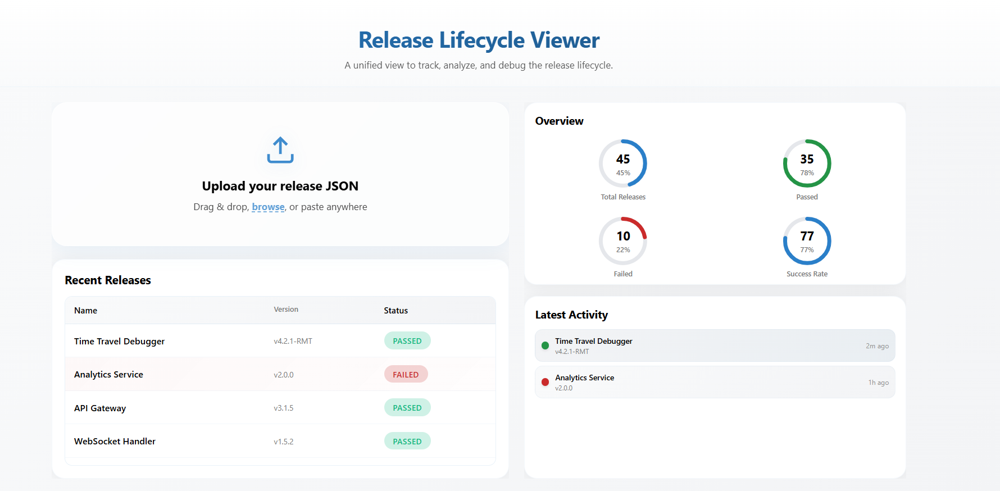

# PAC-Timeline

A release timeline management application with a Go backend API and React frontend.



## Prerequisites

Before you begin, ensure you have the following installed on your local machine:

- **Go** (version 1.16 or higher) - [Download](https://golang.org/dl/)
- **Node.js** (version 14 or higher) - [Download](https://nodejs.org/)
- **MongoDB** (version 4.4 or higher) - [Download](https://www.mongodb.com/try/download/community)
- **Git** - [Download](https://git-scm.com/)

## Installation

### 1. Clone the Repository

```bash
git clone <repository-url>
cd PAC-Timeline
```

### 2. MongoDB Setup

#### Option A: Local MongoDB Installation

If you don't have MongoDB installed:

**On Windows:**
- Download MongoDB Community Edition from [mongodb.com](https://www.mongodb.com/try/download/community)
- Run the installer and follow the installation wizard
- MongoDB will typically install as a Windows Service and start automatically
- Verify installation by opening Command Prompt and running:
  ```bash
  mongosh
  ```

**On macOS:**
```bash
brew tap mongodb/brew
brew install mongodb-community
brew services start mongodb-community
```

**On Linux (Ubuntu):**
```bash
sudo apt-get update
sudo apt-get install -y mongodb-org
sudo systemctl start mongod
```

#### Option B: MongoDB Atlas (Cloud)

If you prefer to use MongoDB Cloud:
1. Go to [MongoDB Atlas](https://www.mongodb.com/cloud/atlas)
2. Create a free account
3. Create a new cluster
4. Get your connection string
5. Update your backend configuration with the Atlas connection string

#### Verify MongoDB is Running

```bash
mongosh
```

If the shell connects successfully, MongoDB is running properly.

### 3. Backend Setup (Go)

Navigate to the backend directory and set up the Go application:

```bash
cd backend
```

Install Go dependencies:

```bash
go mod tidy
```

Configure MongoDB connection (update in your main.go or config file if needed):
- Ensure MongoDB is running on `mongodb://localhost:27017` or set your connection string

Start the Go backend server:

```bash
go run main.go
```

The backend should now be running on `http://localhost:8080` (or your configured port).

### 4. Frontend Setup (React + Vite)

Navigate to the frontend directory and set up the React application:

```bash
cd ../frontend
```

Install Node.js dependencies:

```bash
npm install
```

Start the development server:

```bash
npm run dev
```

The frontend should now be running on `http://localhost:5173` (or your configured port).

## Project Structure

```
PAC-Timeline/
├── backend/                 # Go backend API
│   ├── main.go             # Main application file
│   └── go.mod              # Go module dependencies
├── frontend/               # React frontend application
│   ├── src/
│   │   ├── components/     # React components
│   │   ├── pages/          # Page components
│   │   ├── styles/         # CSS stylesheets
│   │   ├── App.jsx         # Main App component
│   │   └── main.jsx        # Entry point
│   ├── mock-data/          # Mock data files
│   ├── index.html          # HTML template
│   ├── package.json        # Node dependencies
│   └── vite.config.js      # Vite configuration
├── mock-data/              # Sample data
└── README.md               # This file
```

## Running the Application

1. **Start MongoDB** (if not running as a service)
2. **Start Backend**: `cd backend && go run main.go`
3. **Start Frontend**: `cd frontend && npm run dev`
4. **Access the Application**: Open your browser and navigate to `http://localhost:5173`

## Troubleshooting

### MongoDB Connection Issues
- Ensure MongoDB is running: `mongosh`
- Check the connection string in your backend configuration
- Verify MongoDB is listening on `localhost:27017` (default port)

### Backend Port Already in Use
- Change the port in your backend configuration
- Or kill the process using the port: `lsof -ti:8080 | xargs kill -9` (on macOS/Linux)

### Frontend Build Issues
- Delete `node_modules` and `package-lock.json` (or `yarn.lock`)
- Run `npm install` again
- Clear npm cache: `npm cache clean --force`

### Go Module Issues
- Run `go mod tidy` to clean up dependencies
- Run `go mod download` to download all dependencies

## Support

For issues or questions, please open an issue in the repository.
# Release Manager

A simple fullstack application for uploading and managing releases with a React frontend and Go backend with MongoDB.

## Project Structure

```
.
├── frontend/          # React + Vite application
│   ├── src/
│   │   ├── components/
│   │   │   ├── UploadForm.jsx
│   │   │   └── ReleasesList.jsx
│   │   ├── App.jsx
│   │   ├── App.css
│   │   └── main.jsx
│   ├── index.html
│   ├── vite.config.js
│   └── package.json
│
├── backend/           # Go server with MongoDB
│   ├── main.go
│   └── go.mod
│
├── README.md          # This file
└── .gitignore
```

## Prerequisites

- **Node.js** (v16 or higher)
- **Go** (v1.21 or higher)
- **MongoDB** (running on localhost:27017)

## Backend Setup

1. Navigate to the backend folder:
   ```bash
   cd backend
   ```

2. Install dependencies:
   ```bash
   go mod tidy
   ```

3. Run the server:
   ```bash
   go run main.go
   ```

The backend will start on `http://localhost:8000`

**API Endpoints:**
- `POST /api/releases/upload` - Upload a new release
- `GET /api/releases` - Get all releases
- `GET /api/health` - Health check

## Frontend Setup

1. Navigate to the frontend folder:
   ```bash
   cd frontend
   ```

2. Install dependencies:
   ```bash
   npm install
   ```

3. Start the development server:
   ```bash
   npm run dev
   ```

The frontend will start on `http://localhost:3000`

## Usage

1. Make sure MongoDB is running
2. Start the backend server
3. Start the frontend development server
4. Open `http://localhost:3000` in your browser
5. Upload a release by:
   - Selecting a file
   - Entering a version number
   - Adding an optional description
   - Clicking "Upload Release"

## Building for Production

### Frontend
```bash
cd frontend
npm run build
```

### Backend
No build step needed; run with `go run main.go`

## Notes

- MongoDB connection: `mongodb://localhost:27017`
- Database name: `release_manager`
- Collection name: `releases`
- Max file upload size: 10 MB
